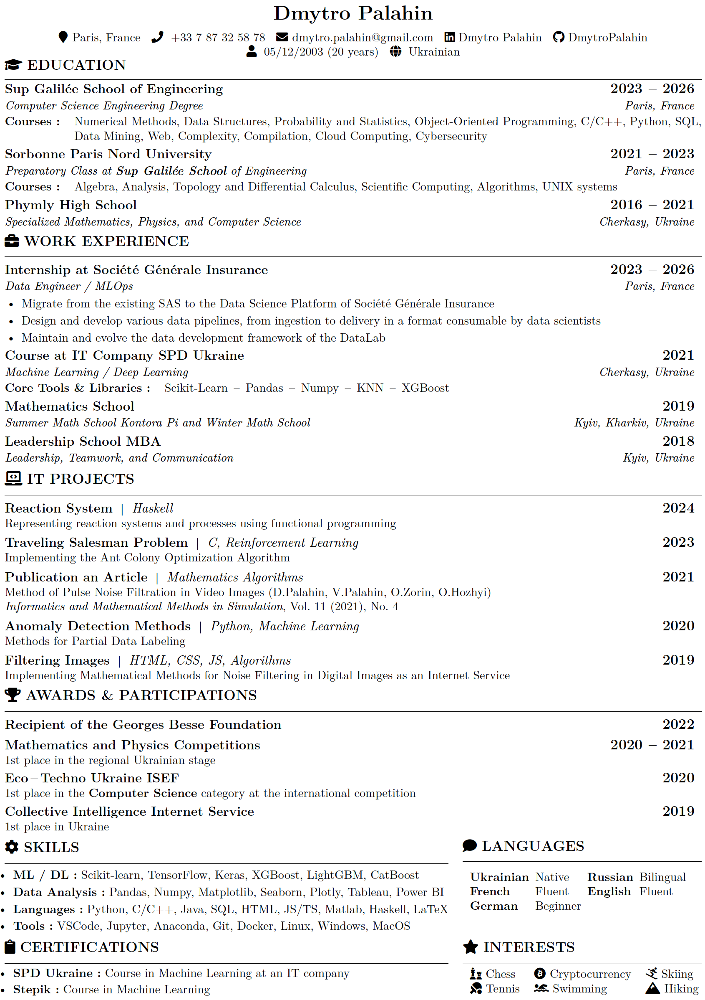

# cv-latex-simple-en

This project contains the LaTeX source code for the CV of Dmytro Palahin.

## 📋 Prerequisites

- 📦 LaTeX distribution (e.g., TeX Live, MiKTeX)
- 🔄 `latexmk` (optional, for automated compilation)

## 📥 Installation

1. Install a LaTeX distribution:
    - 📚 TeX Live: [https://www.tug.org/texlive/](https://www.tug.org/texlive/)
    - 📚 MiKTeX: [https://miktex.org/](https://miktex.org/)

2. Clone the repository:

    ```sh
    git clone https://github.com/DmytroPalahin/cv-latex-simple-en.git
    cd cv-latex-simple-en
    ```

## 🚀 Usage

To compile the CV, run the following command in the `cv-latex-simple-en` directory:

```sh
pdflatex cv-simple-dmytro-palahin-en.tex
```

Or, if you have `latexmk`, `xelatex`, or `lualatex` installed, you can use one of the following commands:

```sh
latexmk -pdf cv-simple-dmytro-palahin-en.tex

xelatex cv-simple-dmytro-palahin-en.tex

lualatex cv-simple-dmytro-palahin-en.tex
```

This will generate a PDF file named `cv-simple-dmytro-palahin-en.pdf`.

## 👀 Preview

Here is a preview of the generated CV:



## 📜 License

This project is licensed under the MIT License - see the [LICENSE](LICENSE) file for details.
