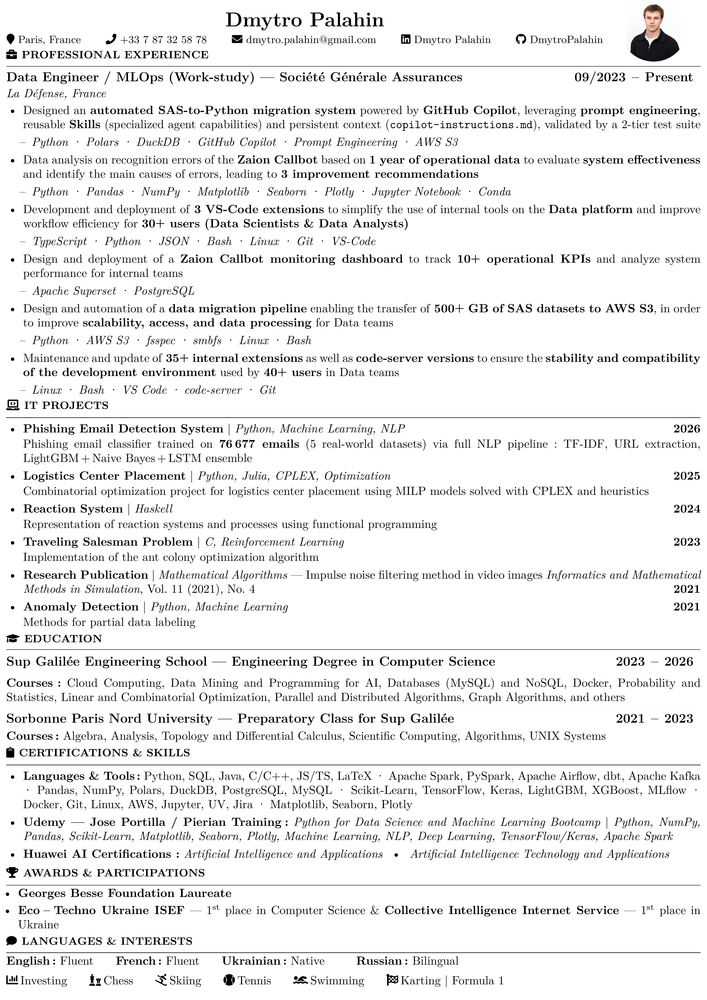
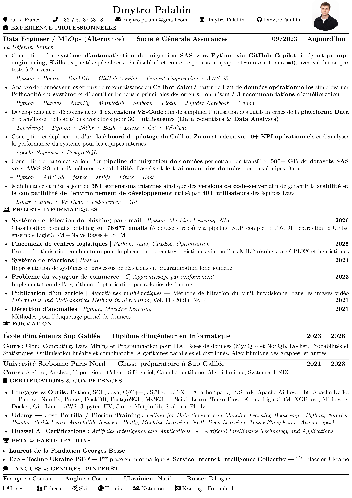
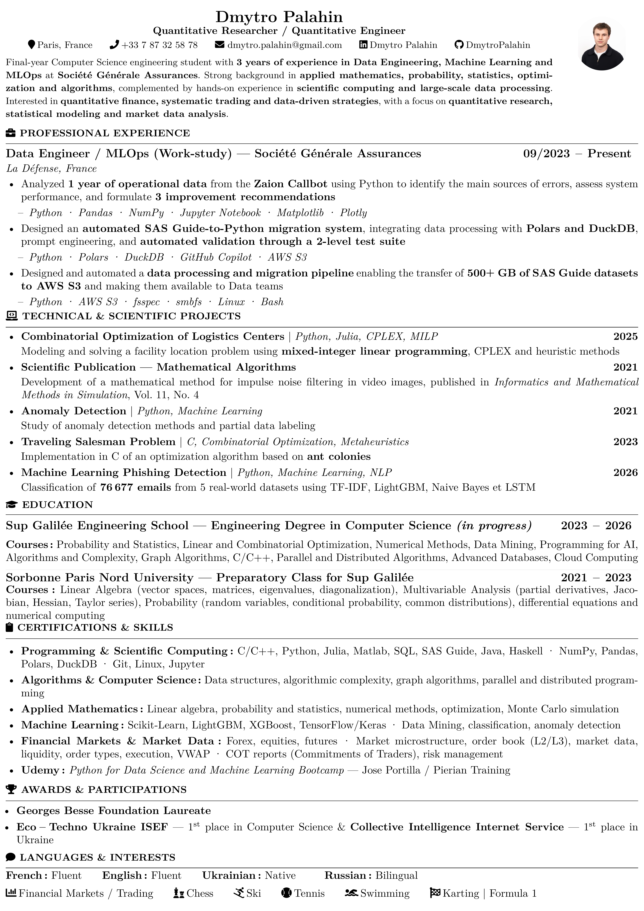
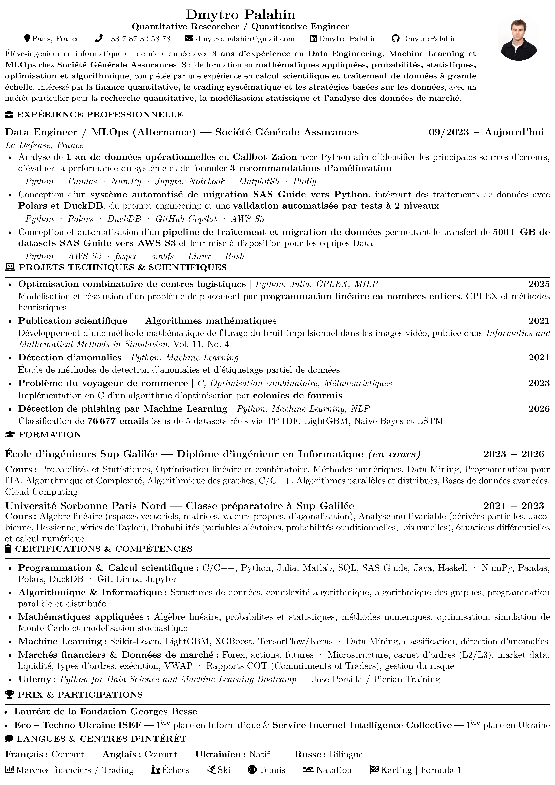

# 📄 cv-latex

> Personal CV of **Dmytro Palahin** - Data Engineer & MLOps  
> Sup Galilée School of Engineering, Paris, France

[](https://github.com/DmytroPalahin/cv-latex/actions/workflows/latex.yml)
[](https://github.com/DmytroPalahin/cv-latex/releases/latest)
[](LICENSE)
[](https://www.latex-project.org/)


---

## 🖼️ Preview

| 🇬🇧 EN - Data Engineer | 🇫🇷 FR - Data Engineer |
| :---: | :---: |
|  |  |

| 🇬🇧 EN - Quant | 🇫🇷 FR - Quant |
| :---: | :---: |
|  |  |

---

## 📁 Project Structure

```text
cv-latex/
├── .github/
│   └── workflows/
│       └── latex.yml          # CI/CD - build & release all PDFs
├── src/
│   ├── en/
│   │   ├── cv-dmytro-palahin-en-d.tex    # Data Engineer / MLOps
│   │   ├── cv-dmytro-palahin-en-q.tex    # Quantitative Researcher
│   │   └── cv-dmytro-palahin-en-tr.tex   # Trading
│   └── fr/
│       ├── cv-dmytro-palahin-fr-d.tex    # Data Engineer / MLOps
│       ├── cv-dmytro-palahin-fr-q.tex    # Quantitative Researcher
│       └── cv-dmytro-palahin-fr-simple.tex
├── resources/
│   ├── img/                   # Preview images for README
│   └── docs/                  # Certificates & supporting docs
├── academic/                  # Academic programme details
├── CHANGELOG.md
├── CONTRIBUTING.md
└── README.md
```

---

## ⚙️ Build locally

Make sure you have a LaTeX distribution installed - [TeX Live](https://www.tug.org/texlive/) (Linux/macOS) or [MiKTeX](https://miktex.org/) (Windows) - with the following packages: `fontawesome5`, `paracol`, `tikz`, `tcolorbox`, `latexmk`.

```sh
# Build one file
latexmk -pdf -auxdir=/tmp/latex-build -outdir=. src/en/cv-dmytro-palahin-en-d.tex

# Build all variants (bash)
for f in src/**/*.tex; do
  latexmk -pdf -auxdir=/tmp/latex-build -outdir="$(dirname $f)" "$f"
done
```

---

## 🚀 CI/CD - GitHub Actions

Every push to `main` triggers a **parallel matrix build** of all 6 CV variants.  
Every **git tag** (`v*.*.*`) additionally creates a **GitHub Release** with all PDFs attached.

```text
push to main  ->  build all 6 PDFs  ->  upload as artifacts (30 days)
git tag v*.*.*  ->  build all 6 PDFs  ->  create GitHub Release with PDFs (permanent)
```

### How to create a release

```sh
git tag v1.3.0
git push origin v1.3.0
```

-> GitHub Release is created automatically at  
`https://github.com/DmytroPalahin/cv-latex/releases/tag/v1.3.0`

---

## 📥 Download latest CV

➡️ **[Latest Release](https://github.com/DmytroPalahin/cv-latex/releases/latest)**

| Version | Language | Focus |
| --------- | ---------- | ------- |
| `en-d` | 🇬🇧 English | Data Engineer / MLOps |
| `en-q` | 🇬🇧 English | Quantitative Researcher |
| `en-tr` | 🇬🇧 English | Trading |
| `fr-d` | 🇫🇷 French | Data Engineer / MLOps |
| `fr-q` | 🇫🇷 French | Quantitative Researcher |
| `fr-simple` | 🇫🇷 French | Simple |

---

## 🤝 Contributing

This is a personal CV repository - external contributions are not expected.  
Feel free to **fork** and adapt the template for your own use.  
See [CONTRIBUTING.md](CONTRIBUTING.md) for details.

---

## 📋 Changelog

See [CHANGELOG.md](CHANGELOG.md) for all notable changes.

---

## 📜 License

[MIT](LICENSE) - free to fork, adapt, and reuse the template.
